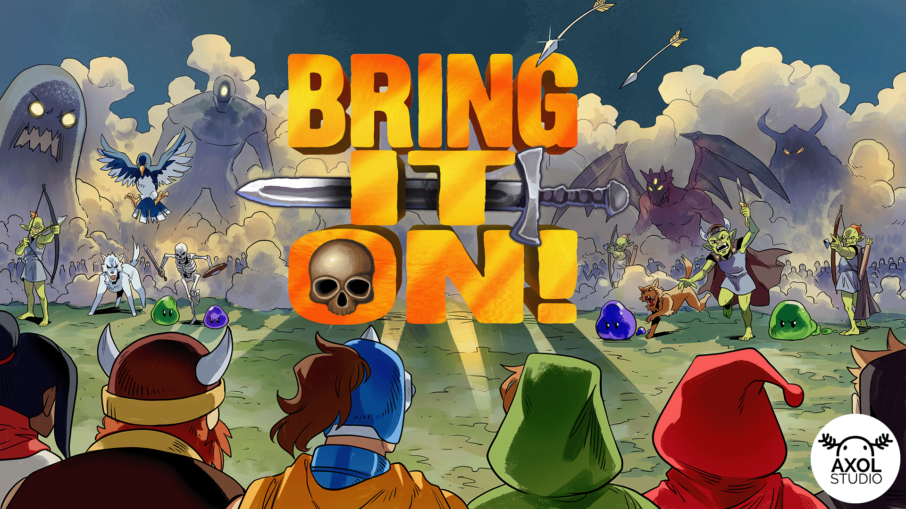
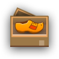

<h1 align="center">Hello! I am Timothy Ian Hely!</h1>
<h3 align="center">Father, game developer, writer, designer, programmer, business owner, maker of things from <a target="blank" href="https://earth.google.com/web/search/St.+Louis+County,+MO/@38.64404295,-90.4271186,172.49348481a,145254.90148081d,35y,0h,0t,0r/data=Cn8aVRJPCiUweDg3ZDhjYWY5YjhlNmVkMDU6MHg3ZDVlN2RlMGFjMWZjNDNiGTiWwWIeTkNAIYQgUbJmmlbAKhRTdC4gTG91aXMgQ291bnR5LCBNTxgCIAEiJgokCQ372PM1ZkNAERM1T0x3UENAGf4fvXB0iFbAIS6AnBFgqFbA"><svg xmlns="http://www.w3.org/2000/svg" width="16" height="16" fill="currentColor" class="bi bi-geo-alt-fill" viewBox="0 0 16 16">
  <path d="M8 16s6-5.686 6-10A6 6 0 0 0 2 6c0 4.314 6 10 6 10zm0-7a3 3 0 1 1 0-6 3 3 0 0 1 0 6z"/>
</svg> St Louis, Mo</a></h3>

---

<h2 align="center">Check out <a href="https://bringiton.axolstudio.com/">Bring It On!</a> My latest game now in Early Access!</h4>

---

## About Me

- I am the Founder of **<a href="https://axolstudio.com/" target="blank">Axol Studio, LLC</a>** - an independent game development company.
- 🎮 I’m currently working on the game **[Bring It On!](https://axolstudio.com/projects/bring_it_on/)**
- 👨‍💻 I have been coding as a hobby since since the age of 7; professionally since 2001.
- 🕹 I frequently participate in Game Jams.
- 🤝 I use and often contribute to **[ HaxeFlixel](https://haxeflixel.com/)**
- 📰 I created **[https://github.com/AxolStudio/STLGameDevRoundUp](https://github.com/AxolStudio/STLGameDevRoundUp)** - A semi-weekly news aggrigation tool for the [St Louis Game Dev Community](http://stlgamedev.com/)
- 🙌 I created **[ snippets.haxeflixel.com](https://snippets.haxeflixel.com/)**
- 🎰 I created **[https://github.com/AxolStudio/hx-crowdcontrol](https://github.com/AxolStudio/hx-crowdcontrol)** - A [Crowd Control 2.0](https://crowdcontrol.live/) library for [Haxe](https://haxe.org/)
- 👨‍💻 My Portfolio can be found at **[tims-world.com/](https://www.tims-world.com/)**
- 📝 I sometimes write things at **[tims-world.com/blog/](https://www.tims-world.com/blog/)**

---

   

 

---
## Languages & Tools

  
  
  
  
  
  
  
  
  
  
  
  
  
  
  
  
  
  
  

---

---

## 🏆 [GitHub Profile Trophies](https://github.com/ryo-ma/github-profile-trophy)

  

